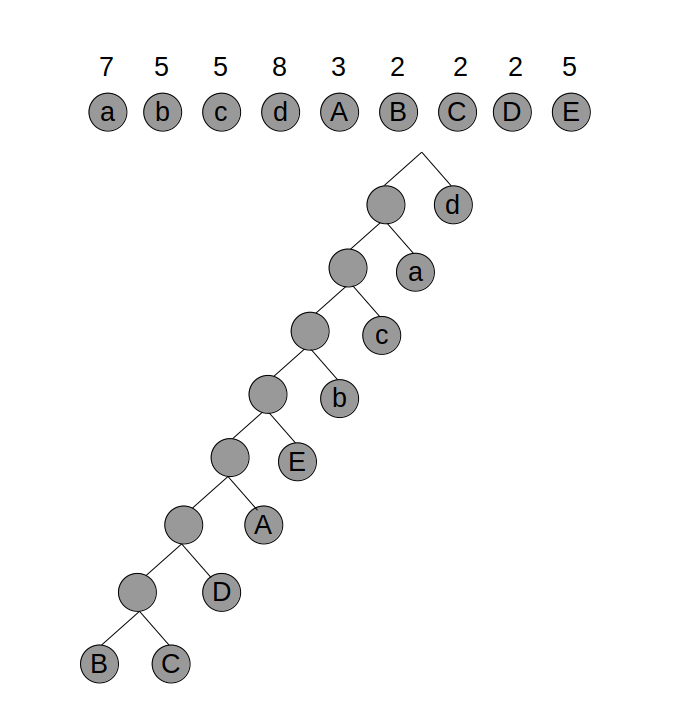

# Exercício 1

## a

```c++
valorMaximo = 0;
lastPos = -1;

for (i = 0; pos[i] > 0; i++) {
    if (abs(pos[i] - lastPos) >= 5 || lastPos == -1) {
        lastPos = pos[i]
        valorMaximo += valor[i]
    }
}

return valorMaximo
```

O algoritmo tem complexidade O(n), corre uma vez para cada posição.

Não é óptimo pois, por exemplo, para: 

- pos[1] = 94, pos[2] = 95, pos[3] = 100
- custo[1] = 1, custo[2] = 6, custo[3] = 4

este algoritmo obtém a solução 5, (pos[1] e pos[3]), enquanto que a solução óptima seria 10.


## b

Considerando e[j] como sendo um vetor que guarda o local mais próximo, no sentido sul, de j, tal que pos[e[j]] <= pos[j] - 5 (como é no sentido sul pos[e[j]] será < pos[j]).

Considerando valorTotal[i], sendo i o local a considerar (valorTotal[0] = valor[0]):
- valorTotal[i] = valor[i], se i == 0
- valorTotal[i] = max(valor[0], ..., valor[i]), se pos[i] - pos[0] < 5
- valorTotal[i] = max(valor[i] + valorTotal[e[i]], ..., valor[e[i] -1] + valorTotal[e[e[i]-1]]), se pos[i] - pos[0] >= 5

seja **n** o tamanho do vetor pos[]

```c++
for (i = 0; i < n; i++) {
    if (i == 0) {
        valorTotal[i] = valor[i]
    } else if (pos[i] - pos[0] < 5) {
        valorTotal[i] = 0
        for (j = 0; j <= i; j++) {
            valorTotal[i] = max(valorTotal[i], valor[j])
        }
    } else {
        valorTotal[i] = 0
        for (j = i; j < e[i]; j++) {
            valorTotal[i] = max(valorTotal[i], valor[j] + valorTotal[e[j]])
        }
    }
}

return valorTotal[n-1]
```

Complexidade temporal é ~ O(n^2).

# Exercício 2

## a

Dijkstra:

|        | A | B | C | D   | E   | F   | G   |
|:------:|:-:|:-:|:---:|:---:|:---:|:---:|:---:|
| init   | 0 | inf | inf | inf | inf | inf  | inf |
| proc A | 0 | inf | 8 | inf | 7 | inf  | inf |
| proc E | 0 | inf | 8 |  10  | 7   | 17 | inf   |
| proc C | 0 | 12 | 8 | 9   | 7   | 17  | inf   |
| proc D | 0 | 10 | 8 | 9   | 7   |  13  |  18  |
| proc B | 0 | 10 | 8 |  9 |  7  |  13  | 18   |
| proc F | 0 | 10 | 8 | 9   | 7   | 13   |  16  |
| proc G | 0 | 10 | 8 | 9   | 7   | 13   | 16   |

Caminho mais curto de A a G: A -> C -> D -> F -> G

## b

```c++
algorithm(G, s) {
    for each v in V do
        dist(v) = DBL_MAX
        path(v) = NULL
        gas(v) = 0
        custo(v) = DBL_MAX
    
    custo(s) = s.preco * 10;
    gas(s) = 10;
    dist(s) = 0;
    Q = empty // min priority queue
    Q.insert(s)
    while(!Q.empty()) {
        v = Q.extractMin() // extracts the one with the least cost
        for each w in Adj(v) do
            if (gas(v) < weight(v, w) && custo(w) > custo(v) + v.preco * 10) {
                custo(w) = custo(v) + v.preco * 10
                gas(w) = gas(v) + 10 - weight(v, w)
                dist(w) = dist(v) + weight(v, w)
                path(w) = v
            } else if (gas(v) > weight(v, w) && custo(w) > custo(v)) {
                custo(w) = custo(v)
                gas(w) = gas(v) - weight(v, w)
                dist(w) = dist(v) + weight(v, w)
                path(w) = v
            } else if (gas(v) >= weight(v, w) && gas(v) - weight(v, w) >= gas(w) &&  custo(w) == custo(v) && dist(w) > dist(v) + weight(v, w))) {
                dist(w) = dist(v) + weight(v, w)
                path(w) = v
            }
    }
}
```
|        |  A | B(2) |  C | D(2) |  E |  F  |  G  |   -   |
|:------:|:--:|:----:|:--:|:----:|:--:|:---:|:---:|:-----:|
| proc A | 10 |  inf | 10 |  inf | 10 | inf | inf | custo |
|        | 10 |   0  |  2 |   0  |  3 |  0  |  0  |  gas  |
| proc C | 10 |  20  | 10 |  10  | 10 | inf | inf |       |
|        | 10 |   8  |  2 |   1  |  3 |  0  |  0  |       |
| proc D | 10 |  20  | 10 |  10  | 10 |  30 |  30 |       |
|        | 10 |   8  |  2 |   1  |  3 |  7  |  2  |       |
| proc E | 10 |  20  | 10 |  10  | 10 |  20 |  30 |       |
|        | 10 |   8  |  2 |   1  |  3 |  3  |  2  |       |
| proc B | 10 |  20  | 10 |  10  | 10 |  20 |  30 |       |
|        | 10 |   8  |  2 |   1  |  3 |  3  |  2  |       |
| proc F | 10 |  20  | 10 |  10  | 10 |  20 |  20 |       |
|        | 10 |   8  |  2 |   1  |  3 |  3  |  0  |       |
| proc G | 10 |  20  | 10 |  10  | 10 |  20 |  20 |       |
|        | 10 |   8  |  2 |   1  |  3 |  3  |  0  |       |

O caminho com menor custo será A -> C -> D -> F ->G

## c

Sim, A -> C -> D -> G -> C -> B -> D -> B -> A -> E -> F -> E -> D -> F -> G

# Exercício 3

## a


 
## b

https://www.quora.com/How-do-I-find-the-second-best-minimum-spanning-tree/answer/Alvaro-Pereira

```
Build first MST
L = list of edges in the first mst, sorted by weight
second_best_cost = INF
for (i=0; i<L.size; i++) {
try to build a mst without using edge L[i]
if it's possible and its cost is < second_best_cost {
second_mst = the new found mst
second_best_cost = its cost
}
}

Since the first MST has at most V-1 edges and you'll create a mst (O(E)) again at each step, this runs in O(V*E).

Notice that:
1) there may not be a second MST (in case the graph it's already its MST)
2) the 2nd mst may have the same cost of the 1st (in case you can remove an edge, but use another one with the same cost that wasn't being used before).
```

# Exercício 4

## a

Não. O fluxo máximo que esta rede pode suportar é 10000 uv, pois apesar de chegarem 50 000 uv ao vértice F, deste apenas podem sair 10 000 uv, sendo este o componente limitante do fluxo.

## b

O volume máximo manter-se-á igual, pois o componente limitante mantém-se igual.

## c
o fluxo máximo será 30 000, sendo o componente limitante o canal GD.
O consumidor de D receberá no máximo 30 000 uv, enquanto que o C receberá no máximo 15 000 uv, ambos dependendo da forma como o fluxo é distribuído na rede.

# Exercício 5

## a

abcdABCDE - 9 símbolos 

Para codificar 9 símbolos diferentes são necessários 4 bits, sendo o custo total de codificação do texto = 39*4 = 156 bits.

## b



custo mínimo total de codificação = 8 + 7*2 + 5*3 + 5*4 + 5*5 + 3*6 + 2*7 + 4*8 = 146 bits

## c

Apesar da diferença não ser muita, com códigos de tamanho variável obtém-se menor custo total de codificação do texto do que com código de tamanho fixo.

Utilizando RLE, a string ficaria:
*a5*b3*C2*d5*E5*D2d*A3abc*d2ba*B2*c4, o que pode ocupar variados tamanhos, dependento do tamanho dos numeros e do tamanho de codificação dos asteriscos e simbolos. Mas geralmente, como existem bastantes letras repetidas juntas, RLE terá menor custo.


# Exercício 6

## a

Existe um numero n (natural) tal que o número de solicitações a atender num minuto >= n?

## b

- o problema é verificável em tempo polinomial (é possível verificar se o número de pedidios por minuto é superior ou igual a k em tempo polinomial), logo é NP.

- o problema é NP-completo, pois o problema da Soma dos Subconjuntos é redutível ao mesmo em tempo polinomial:
    - o inteiro (k) corresponde à bandwidth.
    - pretende-se encontrar um subconjunto, composto por elementos (os pedidos) tal que a soma do tamanho do ficheiro solicitado seja k.


