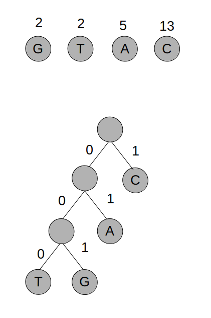

# Exercício 1

## a

```c++
alturaTotal = 0
larguraPrateleira = 0
alturaPrateleira = 0

for i in livros {
    larguraLivro = L[i]
    alturaLivro = A[i]

    if (larguraPrateleira + larguraLivro > LP) {
        // nova prateleira
        alturaTotal += alturaPrateleira
        larguraPrateleira = larguraLivro
        alturaPrateleira = alturaLivro
    } else if (i == livros[n-1]) {
        if (alturaLivro > alturaPrateleira) {
            alturaPrateleira = alturaLivro
        }
        alturaTotal += alturaPrateleira
    } else {
        larguraPrateleira += larguraLivro
        if (alturaLivro > alturaPrateleira) {
            alturaPrateleira = alturaLivro
        }
    }
}

return alturaTotal
```

A complexidade temporal do algoritmo é O(n), pois apenas existe um ciclo que percorre todos os livros.

Este algoritmo não é óptimo.

## b

Seguindo a sugestão:

- Começar pela colocação do último livro.

- Considerar Custo[i] o custo de colocação dos livros i...n, estando i no início de uma prateleira.

```c++
/*
Custo[i] = A[i], se i = n-1
Custo[i] = max(A[i], ..., A[n-1]), se L[i] + ... + L[n-1] <= LP e i < n
Custo[i] = max(A[i], ..., A[j-1]) + Custo[j], sendo j o livro que está no início da prateleira imediatamente abaixo da prateleira de i, se L[i] + ... + L[n-1] > LP e i < n
*/

somaL = 0
i = n-1; // contador global

for ( ; i > 0 && somaL + L[i] <= LP; i--) {
    if (i == n-1) {
        Custo[i] = A[i]
    } else {
        Custo[i] = max(A[i], Custo[i+1])
    }
    somaL += L[i]
}

for ( ; i > 0; i--) {
    j = i
    Custo[i] = A[i]
    somaL = L[i]
    for (j = i + 1; somaL + L[j] <= LP; i--) {
        Custo[i] = max(Custo[i], A[j])
        somaL += L[i]
    }
    Custo[i] = Custo[i] + Custo[j] // j terá o valor do livro que estará no início na prateleira imadiatamente abaixo de i
}
return Custo[0]
```

Complexidade de O(n^2).


# Exercício 2

## a

|        | A | B | C | D   | E   | F   | G   |
|:------:|:-:|:-:|:---:|:---:|:---:|:---:|:---:|
| init   | 0 | inf | inf | inf | inf | inf  | inf |
| proc A | 0 | 1 | 3 | inf | inf | 10  | inf |
| proc B | 0 | 1 | 2 | 8   | 6   | 10  | 3   |
| proc C | 0 | 1 | 2 | 8   | 5   | 10  | 3   |
| proc G | 0 | 1 | 2 | 8   | 5   | 10  | 3   |
| proc E | 0 | 1 | 2 | 7   | 5   | 7   | 3   |
| proc D | 0 | 1 | 2 | 7   | 5   | 7   | 3   |
| proc F | 0 | 1 | 2 | 7   | 5   | 7   | 3   |

Caminho mais curto de A a F: A -> B -> C -> E -> F

## b

dijkstra de vi a vk e de vk a f, concatenação dos caminhos

# Exercício 3

## a 

Pontos de articulação são os pontos que, quando removidos, tornam o grafo desconexo. Assim sendo, os pontos de articulação do grafo são:

- d - quando removido origina duas partes do grafo, sem caminho entre si (desconexas): a-c-f e b-e-g

## b

a -> d -> e -> b -> d -> e -> d -> f -> c -> a


# Exercício 4

## a

Como as arestas que partem de C1 (fonte) têm peso total conjunto máximo de 16000 v/h, o fluxo máximo possível é 16000. O fluxo máximo real será menor pois a aresta A5 apenas poderá ter fluxo de 2000, de modo a não sobrecarregar a aresta N1 que sai do vértice C3, e a aresta A8 apenas poderá ter fluxo máximo real de 4000 de modo a não sobrecarregar a aresta A8 que sai de C2 (fluxo máximo total = 12000).

## b

O troço A1 (de C1 para C4) seria o mais rentável, pois é o tem maior fluxo máximo de veículos por hora (6000). O troço A1 (de C4 a C7) tem a desvantagem de fluxo que chega a C4 ser redirecionado para C6.

# Exercício 5

## a

Como o alfabeto apenas tem 4 símbolos, pode ser representado com log2(4) bits = 2 bits. Tamanho para codificar o gene XPTO = 22*2 = 44 bits.

## b



T = 000 G = 001 A = 01 C = 1

Custo total = 2\*2\*3 + 5\*2 + 13 = 35 bits


# Exercício 6

## a

É possível usar um número k mínimo de slots de 1 hora, de forma que estudantes inscritos em vários cursos não tenham exames sobrepostos?


## b

O problema não tem uma solução eficiente, pois:

- O resultado pode ser verificado em tempo polinomial, logo é NP.
- O problema de coloração de grafos pode ser reduzido em tempo polinomial ao problema apresentado, logo é NP-Completo:

    - Os vértices serão os exames diferentes.
    - As arestas serão as relações entre os exames que não podem ser sobrepostos (por exemplo, consideremos os exames E1, E2 e E3. O aluno A1 está inscrito nos exames E2 e E3, o que se traduz numa aresta entre E2 e E3).
    - Os vértices que tiveres cores iguais, no final do algoritmo de coloração, correspondem a exames que podem utilizar os mesmos slots de 1 hora.
    - O número de cores diferentes é o número mínimo de slots de 1 hora nevessários.

