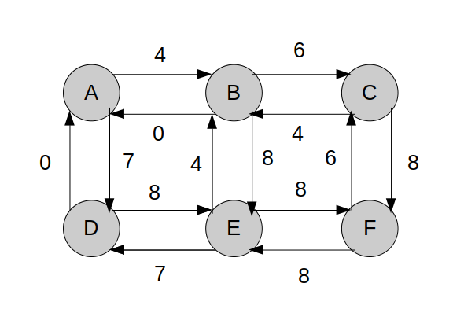

# Exercício 1

## a

m(i) = 0, se i = n
m(i) = min(f(i, j) + m(j), ..., f(i, n) + m(n)), em que j = i+1, i+2, ... n

## b
considerando primeiro índice = 1

```c++
custoOptimo[n] = 0
for (i = n-1; i > 0; i--) {
    custoOptimo[i] = f[i][n]
    for (j = i+1; j < n; j++) {
        custoOptimo[i] = min(f[i][j] + m[j], custoOptimo[i])
    }
}
return custoOptimo[1]
```

O(n^2), S(n)

# Exercício 2

## a

Encontrar o caminho mais curto do vertice superior esquerdo ap vértice inferior direito. Os quadrados são os vértices e os valores dos quadrados são os pesos das arestas que vêm de outro vértice para esse vértice (Por exemplo, o quadrado 0 é um vértice com 4 arestas, uma com peso 4 (0 -> 4), outra com peso 7 (0 -> 7) e as outras duas com peso 0 (de 4 -> 0 e 7 -> 0)).



## b

|        | A |  B  |  C  |  D  |  E  |  F  |
|:------:|:-:|:---:|:---:|:---:|:---:|:---:|
|  init  | 0 | inf | inf | inf | inf | inf |
| proc A | 0 |  4  | inf |  7  | inf | inf |
| proc B | 0 |  4  |  10 |  7  |  12 | inf |
| proc D | 0 |  4  |  10 |  7  |  12 | inf |
| proc C | 0 |  4  |  10 |  7  |  12 |  18 |
| proc E | 0 |  4  |  10 |  7  |  12 |  18 |
| proc F | 0 |  4  |  10 |  7  |  12 |  18 |

A -> B -> C -> F

## c

Pode ser usado o algoritmo de Dijkstra, mas apenas com as arestas que estão de acordo com as restrições aos movimentos. O((|V|+|E|)log(|V|)).


# Exercício 3

## a

Não me apetece desenhar, fluxo máximo = 15000 uv/h.

## b

O fluxo máximo resultante será o mesmo, porque não há alterações significativas que influenciem em fluxo máximo.

## c

O fluxo máximo será o mesmo.


# Exercício 4

## a

Existe um número d tal que a distância total de ligação entre os troços <= d?

## b

- O problema é NP pois é verificável em tempo polinomial (Facilmente verifica-se em tempo polinomial que a distância de ligação dos grafos é <= d).

- O problema é NP-Completo pois o problema do caixeiro viajante é redutivel ao mesmo em tempo polinomial:
    - Os vértices são o início dos troços.
    - O peso das arestas é a distância entre os pontos envolvidos. 
    - Para os vértices que têm restrições (i, j => i ocorre antes de j), por exemplo (i, j) -> o vértice i apenas tem uma aresta outgoing, para j, e o j apenas tem uma aresta ingoing, de i.
    - Para todos os outros, formam arestas entre si, respeitando a restrição anterior.
    - A distância do caminho resultante é o valor d.

